# AI Career Assistant — 全功能数据流程图（函数级精确版）

> 每个流程图精确标注：组件名 → 函数名 → API路径 → 数据库表 → 数据字段变换

---

## 1. 用户认证完整流程

### 1.1 页面加载 → 鉴权检查

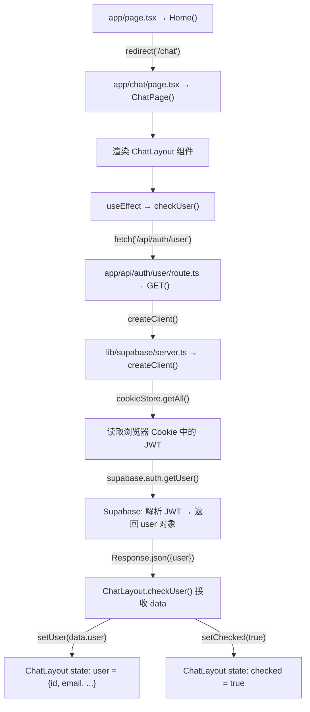

### 1.2 登录流程

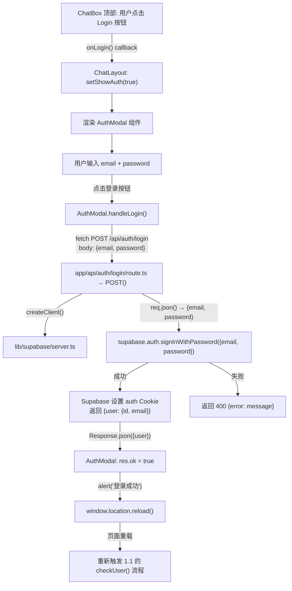

### 1.3 注册流程

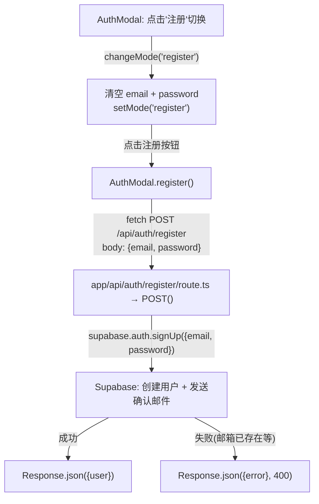

### 1.4 登出流程

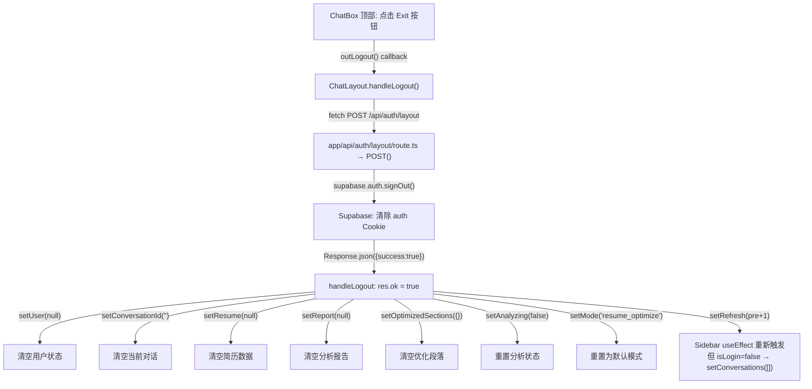

---

## 2. 对话管理流程

### 2.1 创建新对话

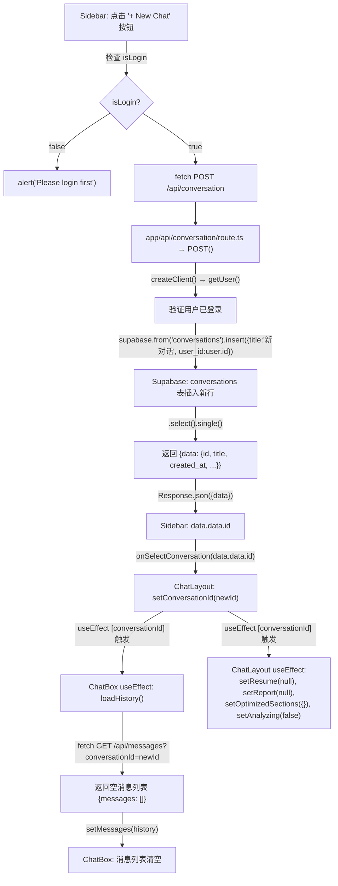

### 2.2 切换对话

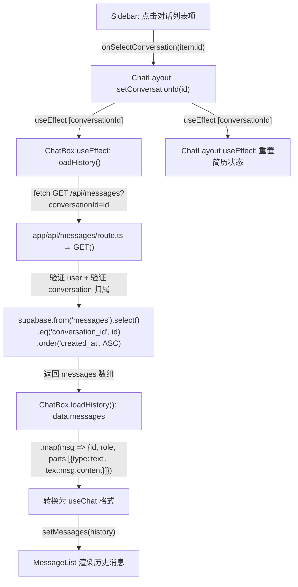

### 2.3 删除对话

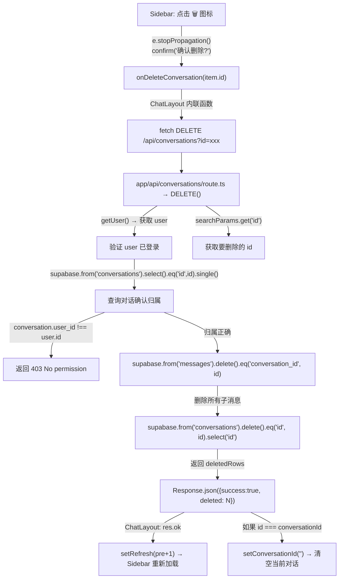

### 2.4 加载对话列表

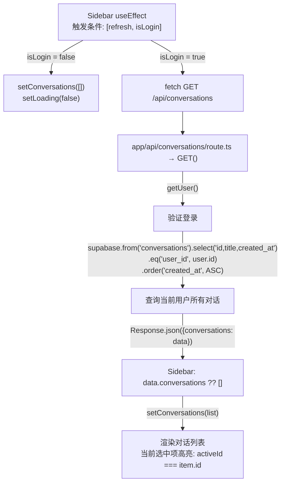

---

## 3. AI 聊天消息流程

### 3.1 发送消息完整链路

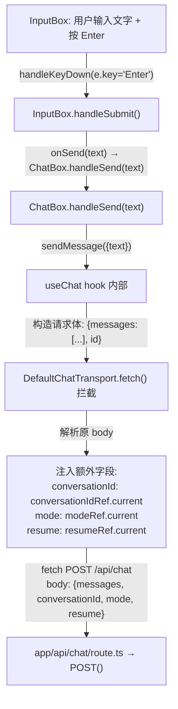

### 3.2 /api/chat 内部处理流程

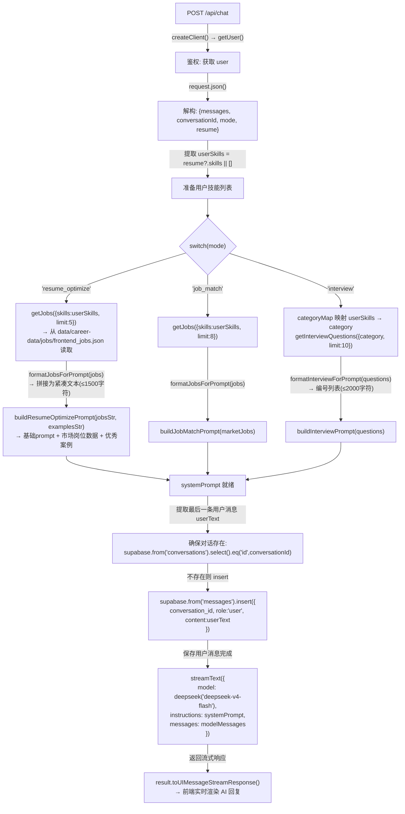

### 3.3 AI 流式响应 + onFinish 回调

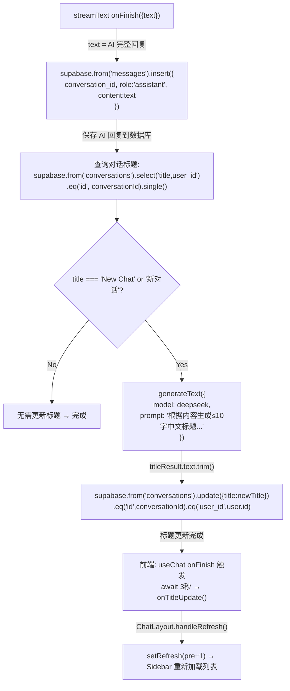

### 3.4 消息渲染流程

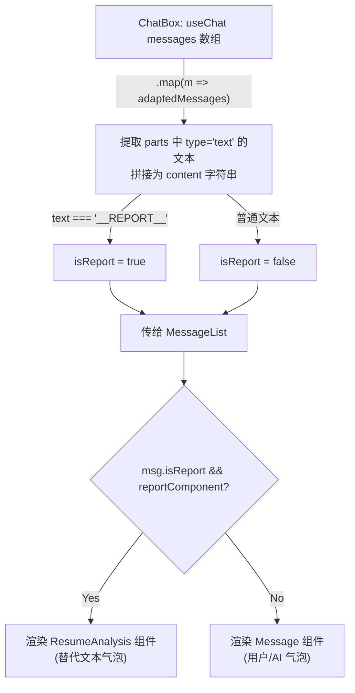

---

## 4. 简历优化完整流程（核心）

### 4.1 文件上传 + 文本提取

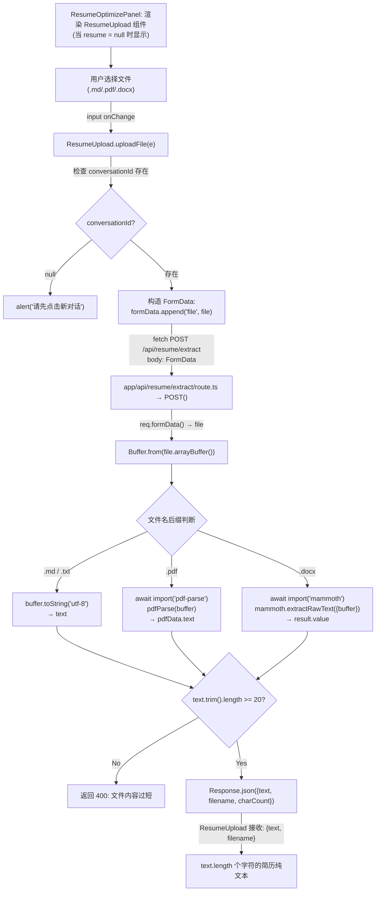

### 4.2 简历存储 + AI 结构化解析

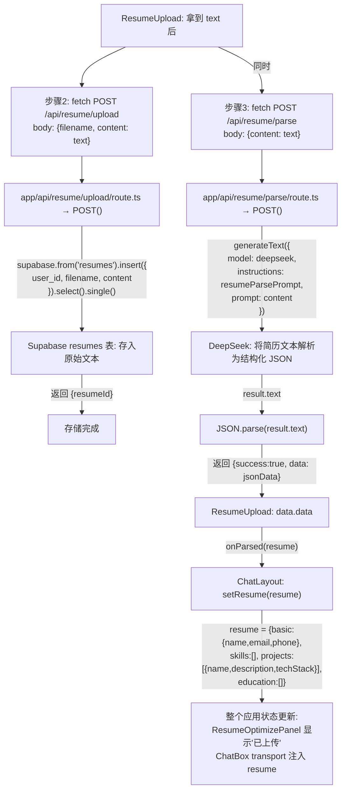

### 4.3 用户画像生成 + 深度分析

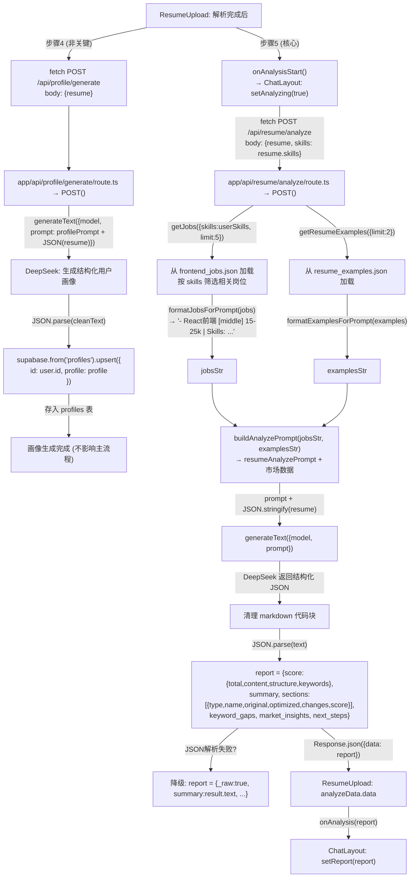

### 4.4 报告注入聊天 + 标题生成 + 消息保存

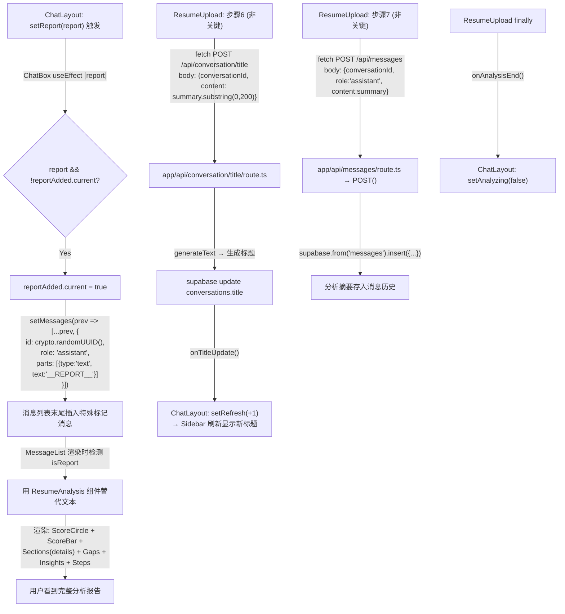

### 4.5 分段深度优化

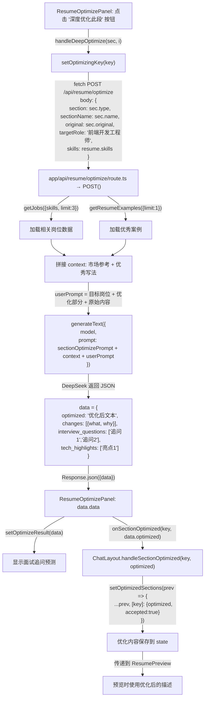

### 4.6 简历预览 + PDF 导出

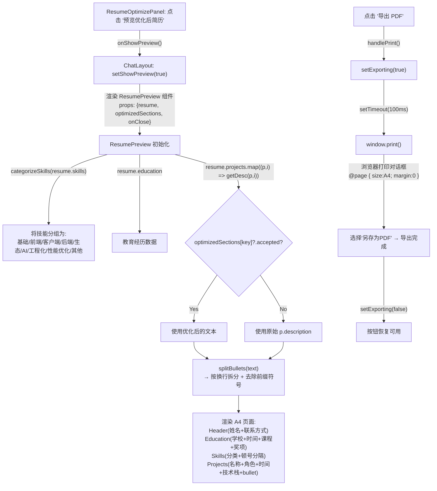

---

## 5. 模式切换流程

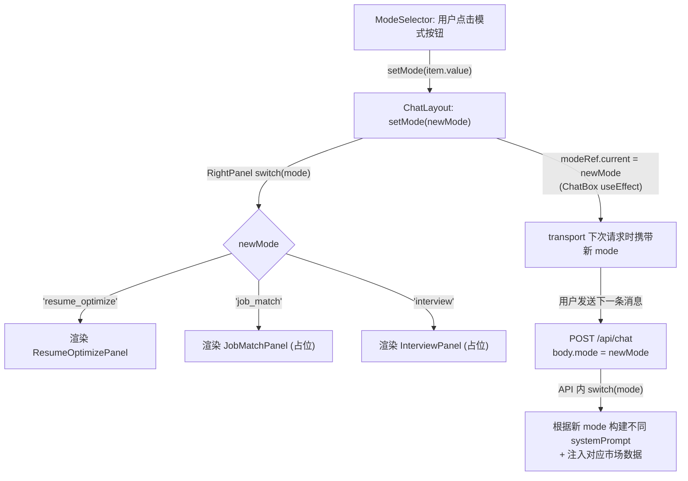

---

## 6. 爬虫数据采集流程

### 6.1 CLI 触发

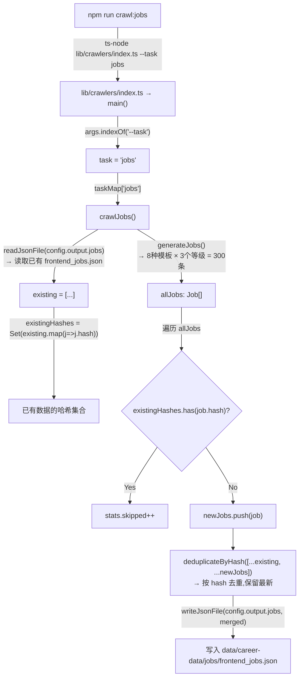

### 6.2 API 触发

```mermaid
graph TB
    A["fetch POST /api/crawler/run?task=jobs"] --> B["app/api/crawler/run/route.ts → POST()"]
    B -->|"getUser() 鉴权"| C["验证用户"]
    C -->|"execFileAsync('npx',\n['ts-node','lib/crawlers/index.ts','--task','jobs'])"| D["子进程执行爬虫脚本"]
    D -->|"timeout: 300000 (5分钟)"| E{"执行结果"}
    E -->|成功| F["Response.json({success, task, stdout})"]
    E -->|失败| G["Response.json({error, detail, stderr}, 500)"]
```

### 6.3 定时任务

```mermaid
graph TB
    A["npm run schedule"] -->|"ts-node lib/crawlers/scheduler.ts"| B["lib/crawlers/scheduler.ts"]
    B -->|"cron.validate(schedule)\nschedule = config.schedule = '0 2 * * *'"| C["验证 cron 表达式"]
    C -->|"cron.schedule(schedule, async ()=>{runAll()})"| D["每天凌晨 2:00 触发"]
    D -->|"依次执行"| E["crawlJobs()"]
    E --> F["crawlSkills()"]
    F --> G["crawlInterview()"]
    G --> H["crawlProjects()"]
    H --> I["crawlArticles()"]
    I --> J["输出 summary: 每个任务的 added/skipped/errors"]
```

### 6.4 数据加载器缓存机制

```mermaid
graph TB
    A["API 路由调用 getJobs({skills,limit})"] --> B["loader.ts → readJsonCached(filePath)"]
    B -->|"fs.existsSync(filePath)"| C{文件存在?}
    C -->|No| D["返回空数组 []"]
    C -->|Yes| E["fs.statSync(filePath).mtimeMs"]
    E --> F{"cache.get(filePath)?.mtime === stat.mtimeMs?"}
    F -->|Yes (60s内未修改)| G["返回缓存数据 cached.data"]
    F -->|No (文件已更新)| H["fs.readFileSync → JSON.parse"]
    H -->|"cache.set(filePath, {data, mtime})"| I["更新缓存并返回新数据"]
    I --> J["data = allJobs"]
    J --> K{"options.level?"}
    K -->|Yes| L["data = data.filter(j => j.level === level)"]
    K -->|No| M["跳过筛选"]
    L --> N{"options.skills?.length?"}
    M --> N
    N -->|Yes| O["skillSet = Set(skills)\ndata.filter(j => j.skills.some(s => skillSet.has(s)))"]
    N -->|No| P["跳过筛选"]
    O --> Q["data.slice(0, limit)"]
    P --> Q
    Q --> R["返回过滤后的 Job 数组"]
```

---

## 7. 职业数据注入 AI Prompt 的完整链路

```mermaid
graph TB
    subgraph 数据源
        F1["data/career-data/jobs/frontend_jobs.json"]
        F2["data/career-data/interview/questions.json"]
        F3["data/career-data/resume/resume_examples.json"]
        F4["data/career-data/projects/projects.json"]
    end
    
    subgraph loader 层
        L1["getJobs({skills, limit})"] --> FMT1["formatJobsForPrompt(jobs, maxChars=1500)\n→ '- React前端 [middle] 15-25k\n| Skills: React, TypeScript, ...\n- Vue前端 [junior] 9-14k\n| Skills: Vue3, Vite, ...'"]
        L2["getInterviewQuestions({category, limit})"] --> FMT2["formatInterviewForPrompt(questions, maxChars=2000)\n→ '1. [react/junior] React中useEffect...\n2. [react/middle] 如何优化...\n...'"]
        L3["getResumeExamples({limit})"] --> FMT3["formatExamplesForPrompt(examples, maxChars=2000)\n→ '## 前端开发 (middle)\nSummary: ...\nSkills: ...\nProjects:\n  - 项目名: 描述'"]
    end
    
    subgraph Prompt 构建层
        FMT1 --> P1["buildResumeOptimizePrompt(jobs, examples)"]
        FMT1 --> P2["buildJobMatchPrompt(jobs)"]
        FMT2 --> P3["buildInterviewPrompt(questions)"]
        FMT3 --> P1
        FMT1 --> P4["buildAnalyzePrompt(jobs, examples)"]
        FMT3 --> P4
    end
    
    subgraph API 路由层
        P1 --> API1["POST /api/chat (mode=resume_optimize)"]
        P2 --> API2["POST /api/chat (mode=job_match)"]
        P3 --> API3["POST /api/chat (mode=interview)"]
        P4 --> API4["POST /api/resume/analyze"]
    end
    
    subgraph AI 层
        API1 --> DS["streamText → DeepSeek\nsystemPrompt 包含真实市场数据"]
        API2 --> DS
        API3 --> DS
        API4 --> DS2["generateText → DeepSeek\nprompt 包含真实市场数据"]
    end
    
    F1 --> L1
    F2 --> L2
    F3 --> L3
```

---

## 8. 全局状态传递关系图

```mermaid
graph LR
    subgraph ChatLayout 管理的状态
        S1["conversationId: string"]
        S2["user: object | null"]
        S3["mode: Mode"]
        S4["resume: object | null"]
        S5["report: ResumeReport | null"]
        S6["optimizedSections: object"]
        S7["showPreview: boolean"]
        S8["analyzing: boolean"]
        S9["refresh: number"]
        S10["showAuth: boolean"]
    end
    
    subgraph 传递给 Sidebar
        S1 -->|"activeId"| SB1["高亮当前对话"]
        S2 -->|"isLogin"| SB2["是否显示对话列表"]
        S9 -->|"refresh"| SB3["触发重新加载"]
    end
    
    subgraph 传递给 ChatBox
        S1 -->|"conversationId"| CB1["useChat + transport"]
        S3 -->|"mode"| CB2["transport 注入 + ModeSelector"]
        S4 -->|"resume"| CB3["transport 注入"]
        S5 -->|"report"| CB4["__REPORT__ 标记 + ResumeAnalysis"]
    end
    
    subgraph 传递给 RightPanel
        S1 -->|"conversationId"| RP1["ResumeUpload 需要"]
        S3 -->|"mode"| RP2["switch 渲染不同面板"]
        S4 -->|"resume"| RP3["ResumeOptimizePanel"]
        S5 -->|"report"| RP4["显示评分 + 段落卡片"]
        S6 -->|"optimizedSections"| RP5["显示已优化状态"]
        S8 -->|"analyzing"| RP6["显示加载状态"]
    end
    
    subgraph 回调函数向上传递
        RP3 -->|"onResumeChange"| S4
        RP4 -->|"onReport"| S5
        RP5 -->|"onSectionOptimized"| S6
        RP6 -->|"onAnalyzingChange"| S8
        CB1 -->|"onTitleUpdate"| S9
    end
    
    subgraph 覆盖层组件
        S7 -->|"showPreview=true"| OVR1["ResumePreview\nprops: resume + optimizedSections"]
        S10 -->|"showAuth=true"| OVR2["AuthModal"]
    end
```


---

## 9. 页面关系与组件树图

### 9.1 页面路由与导航关系

```mermaid
graph TB
    subgraph "Next.js App Router 页面"
        ROOT["/ — app/page.tsx\nHome()\n服务端组件"]
        CHAT["/chat — app/chat/page.tsx\nChatPage()\n服务端组件"]
        TEST["/test — app/test/page.tsx\nResumeTestPage()\n客户端组件"]
    end

    subgraph "中间件保护"
        MW["app/middleware.ts\nmatcher: /chat/:path*\n未登录 → 重定向到 /\nAPI请求未登录 → 返回 401"]
    end

    ROOT -->|"redirect('/chat')"| CHAT
    MW -->|"检查 Supabase Cookie\n通过则放行"| CHAT
    MW -->|"未登录"| ROOT

    ROOT -.->|"用户手动访问 /test\n(无中间件保护)"| TEST
```

### 9.2 各页面组件树

```mermaid
graph TB
    subgraph "页面: / (根路由)"
        P_ROOT["app/page.tsx → Home()\n纯服务端: redirect('/chat')\n无UI渲染"]
    end

    subgraph "页面: /chat (主页面)"
        P_CHAT["app/chat/page.tsx → ChatPage()"]
        P_CHAT --> CL["ChatLayout\n(主容器,管理10个state)"]

        CL --> SB["Sidebar\n对话历史列表"]
        CL --> CB["ChatBox\n聊天核心"]
        CL --> RP["RightPanel\n功能面板路由"]
        CL --> AM["AuthModal\n登录/注册弹窗\n(条件渲染)"]
        CL --> PV["ResumePreview\n简历预览+PDF\n(条件渲染)"]

        SB --> BTN_NEW["'+ New Chat' 按钮"]
        SB --> CONV_LIST["对话列表项\n(点击切换 + 删除)"]

        CB --> HDR["Header\nAI Assistant + Login/Exit + 用户信息"]
        CB --> ML["MessageList\n消息列表"]
        CB --> MS["ModeSelector\n📝简历/🎯岗位/🎤面试"]
        CB --> IB["InputBox\n消息输入框"]

        ML --> MSG_U["Message (user)\n用户消息气泡"]
        ML --> MSG_A["Message (assistant)\nAI消息气泡"]
        ML --> RA["ResumeAnalysis\n分析报告组件\n(__REPORT__标记时)"]

        RP --> RP_R["ResumeOptimizePanel\n(mode=resume_optimize)"]
        RP --> RP_J["JobMatchPanel\n(mode=job_match) 占位"]
        RP --> RP_I["InterviewPanel\n(mode=interview) 占位"]

        RP_R --> RU["ResumeUpload\n文件上传+全流程编排"]
        RP_R --> SCORE["评分卡片\n总分+摘要"]
        RP_R --> SEC_CARDS["段落卡片\n深度优化按钮"]
        RP_R --> BTN_PREVIEW["'预览优化后简历' 按钮"]
    end

    subgraph "页面: /test (测试页)"
        P_TEST["app/test/page.tsx → ResumeTestPage()"]
        P_TEST --> RU_TEST["ResumeUpload\n(独立测试,回调全部 console.log)"]
    end
```

### 9.3 页面间共享的组件与数据

```mermaid
graph LR
    subgraph "共享组件"
        RU["ResumeUpload"]
        STYLES["CSS Modules\n(css/*.module.css)"]
    end

    subgraph "共享库"
        SUPA_C["lib/supabase/client.ts\n浏览器端 Supabase"]
        SUPA_S["lib/supabase/server.ts\n服务端 Supabase"]
        DS["lib/deepseek/ai.ts\nDeepSeek 客户端"]
        PROMPTS["lib/prompts/resume.ts\n所有 Prompt 模板"]
        LOADER["lib/career-data/loader.ts\n职业数据加载器"]
        TYPES["types/*.ts\n类型定义"]
    end

    subgraph "共享 API 路由"
        AUTH["/api/auth/*"]
        CHAT_API["/api/chat"]
        CONV_API["/api/conversation*"]
        MSG_API["/api/messages"]
        RESUME_API["/api/resume/*"]
        CAREER_API["/api/career/*"]
        PROFILE_API["/api/profile/*"]
    end

    subgraph "页面: /chat"
        C1["ChatLayout\n使用: SUPA_C, TYPES"]
        C2["ChatBox\n使用: CHAT_API, MSG_API, TYPES"]
        C3["ResumeUpload\n使用: RESUME_API, PROFILE_API"]
        C4["AuthModal\n使用: AUTH, SUPA_C"]
        C5["ResumePreview\n使用: STYLES"]
    end

    subgraph "页面: /test"
        T1["ResumeTestPage\n使用: RU"]
    end

    RU --> C1
    RU --> T1
    RU --> RESUME_API
    RU --> PROFILE_API

    C1 --> CONV_API
    C2 --> CHAT_API
    C2 --> MSG_API
    C4 --> AUTH

    CHAT_API --> DS
    CHAT_API --> PROMPTS
    CHAT_API --> LOADER
    CHAT_API --> SUPA_S

    RESUME_API --> DS
    RESUME_API --> PROMPTS
    RESUME_API --> LOADER
    RESUME_API --> SUPA_S

    AUTH --> SUPA_S
```

### 9.4 用户操作路径图（用户视角）

```mermaid
graph TB
    START(["用户打开浏览器\n访问 localhost:3000"]) --> REDIRECT["/ → redirect('/chat')"]
    REDIRECT --> AUTH_CHECK{"middleware 检查\nCookie 中有 JWT?"}

    AUTH_CHECK -->|No| LOGIN_PAGE["回到 /\nChatLayout 渲染\nuser=null"]
    LOGIN_PAGE --> CLICK_LOGIN["点击 Login 按钮"]
    CLICK_LOGIN --> MODAL["AuthModal 弹出\n输入 email + password"]
    MODAL --> DO_LOGIN["POST /api/auth/login"]
    DO_LOGIN --> RELOAD["window.location.reload()"]
    RELOAD --> AUTH_CHECK

    AUTH_CHECK -->|Yes| CHAT_READY["/chat 页面就绪\nChatLayout 渲染完整UI"]

    CHAT_READY --> PATH_NEW["路径A: 新建对话\n点击 '+ New Chat'"]
    CHAT_READY --> PATH_RESUME["路径B: 上传简历\n右侧面板点击上传"]
    CHAT_READY --> PATH_CHAT["路径C: 发送消息\n输入框输入文字"]
    CHAT_READY --> PATH_MODE["路径D: 切换模式\n点击底部模式按钮"]

    PATH_NEW -->|"POST /api/conversation\n→ 获得 conversationId"| CONVERSATION["对话已创建\n可开始交互"]

    CONVERSATION --> PATH_RESUME
    CONVERSATION --> PATH_CHAT

    PATH_RESUME -->|"选文件 → extract → parse\n→ analyze → report"| REPORT["分析报告生成\n聊天区+右面板同步显示"]

    REPORT --> PATH_OPTIMIZE["点击 '深度优化此段'\n→ POST /api/resume/optimize"]
    PATH_OPTIMIZE --> OPTIMIZED["段落已优化\n自动接受"]

    OPTIMIZED --> PATH_PREVIEW["点击 '预览优化后简历'"]
    PATH_PREVIEW --> PREVIEW["ResumePreview 全屏覆盖\nA4单栏模板"]

    PREVIEW --> PATH_PDF["点击 '导出 PDF'"]
    PATH_PDF --> PDF["window.print()\n浏览器保存为PDF"]

    PATH_CHAT -->|"sendMessage → POST /api/chat\n→ streamText → 流式渲染"| AI_REPLY["AI 实时回复"]
    AI_REPLY -->|"onFinish → 保存消息\n→ 生成标题"| TITLE["侧边栏标题更新"]

    PATH_MODE -->|"setMode('job_match')\n或 setMode('interview')"| MODE_SWITCH["右面板切换\n下次消息用新 systemPrompt"]
```

### 9.5 API 路由与数据库表的对应关系

```mermaid
graph LR
    subgraph "API 路由"
        A_LOGIN["POST /api/auth/login"]
        A_REG["POST /api/auth/register"]
        A_USER["GET /api/auth/user"]
        A_LOGOUT["POST /api/auth/layout"]
        A_CHAT["POST /api/chat"]
        A_CONV_POST["POST /api/conversation"]
        A_CONV_TITLE["POST /api/conversation/title"]
        A_CONVS_GET["GET /api/conversations"]
        A_CONVS_DEL["DELETE /api/conversations"]
        A_MSG_GET["GET /api/messages"]
        A_MSG_POST["POST /api/messages"]
        A_RES_UPLOAD["POST /api/resume/upload"]
        A_RES_PARSE["POST /api/resume/parse"]
        A_RES_ANALYZE["POST /api/resume/analyze"]
        A_RES_OPT["POST /api/resume/optimize"]
        A_PROF_GEN["POST /api/profile/generate"]
        A_PROF_POST["POST /api/profile"]
        A_CAREER["GET /api/career/*"]
        A_CRAWL["POST /api/crawler/run"]
    end

    subgraph "Supabase 表"
        T_USERS["auth.users\n(Supabase 内置)"]
        T_CONV["conversations\nid, user_id, title, created_at"]
        T_MSG["messages\nid, conversation_id, role, content"]
        T_RESUME["resumes\nid, user_id, filename, content"]
        T_PROFILE["profiles\nid(=user.id), profile(jsonb)"]
    end

    subgraph "外部服务"
        E_DEEPSEEK["DeepSeek API\ndeepseek-v4-flash"]
        E_FS["本地文件系统\ndata/career-data/"]
    end

    A_LOGIN -->|"signInWithPassword"| T_USERS
    A_REG -->|"signUp"| T_USERS
    A_USER -->|"getUser"| T_USERS
    A_LOGOUT -->|"signOut"| T_USERS

    A_CHAT -->|"insert user+assistant msg"| T_MSG
    A_CHAT -->|"ensure conv exists"| T_CONV
    A_CONV_POST -->|"insert"| T_CONV
    A_CONV_TITLE -->|"update title"| T_CONV
    A_CONVS_GET -->|"select by user_id"| T_CONV
    A_CONVS_DEL -->|"delete conv + msgs"| T_CONV
    A_CONVS_DEL -->|"delete msgs first"| T_MSG
    A_MSG_GET -->|"select by conv_id"| T_MSG
    A_MSG_POST -->|"insert"| T_MSG

    A_RES_UPLOAD -->|"insert"| T_RESUME
    A_PROF_GEN -->|"upsert"| T_PROFILE
    A_PROF_POST -->|"upsert"| T_PROFILE

    A_CHAT -->|"streamText"| E_DEEPSEEK
    A_RES_PARSE -->|"generateText"| E_DEEPSEEK
    A_RES_ANALYZE -->|"generateText"| E_DEEPSEEK
    A_RES_OPT -->|"generateText"| E_DEEPSEEK
    A_CONV_TITLE -->|"generateText"| E_DEEPSEEK
    A_PROF_GEN -->|"generateText"| E_DEEPSEEK

    A_RES_ANALYZE -->|"getJobs, getResumeExamples"| E_FS
    A_RES_OPT -->|"getJobs, getResumeExamples"| E_FS
    A_CHAT -->|"getJobs, getInterviewQuestions"| E_FS
    A_CAREER -->|"直接读取 JSON"| E_FS
```

---

> 文档更新时间：2026-07-25 | 共 30 个流程图，覆盖页面关系、组件树、用户操作路径、API-数据库映射
