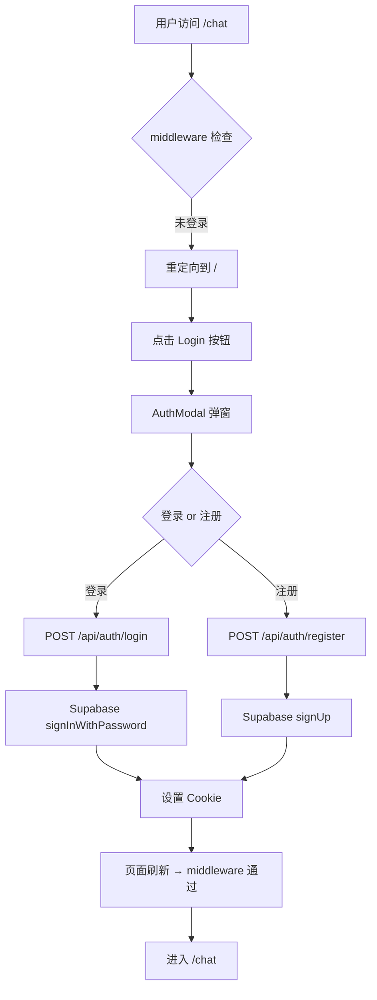
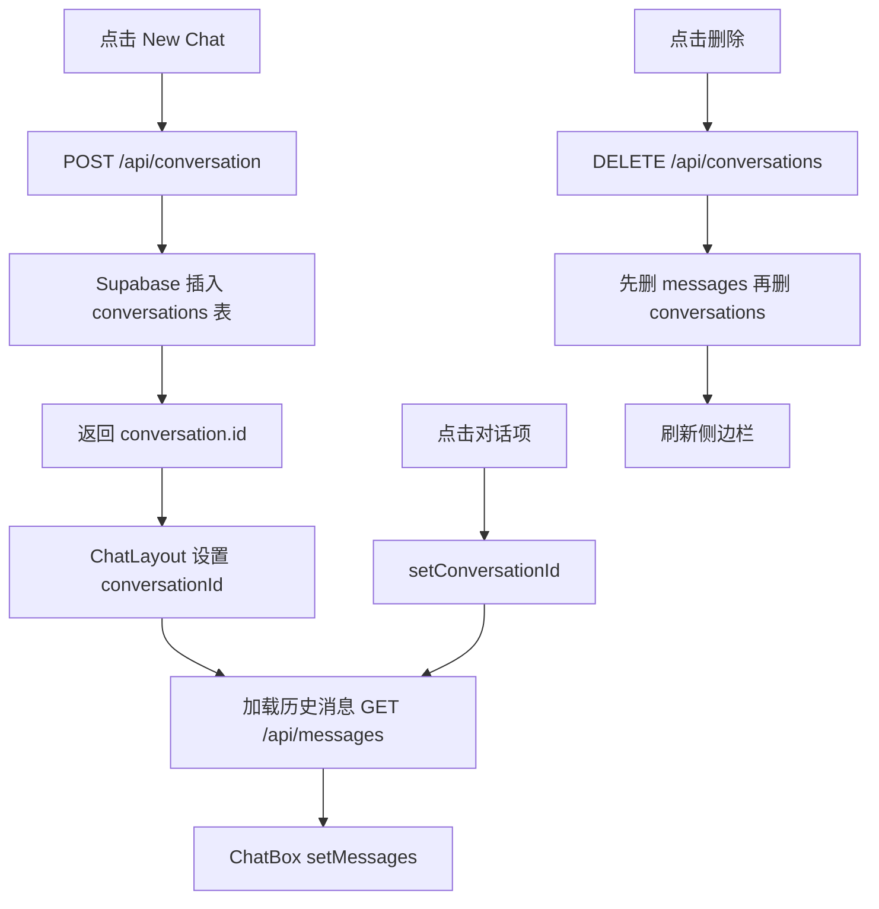
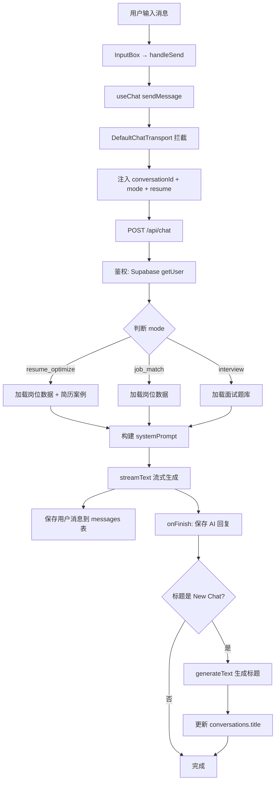
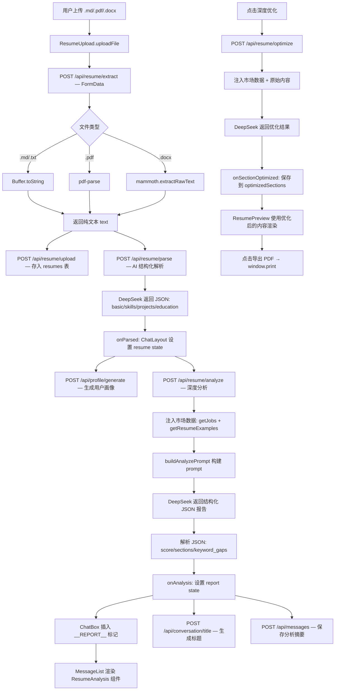
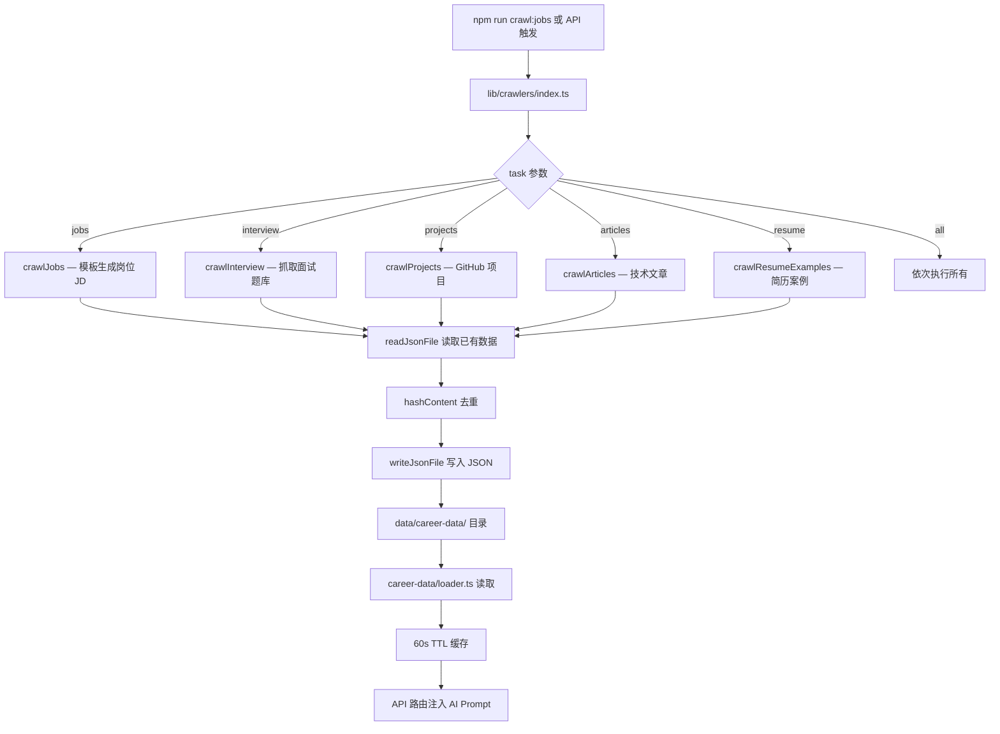
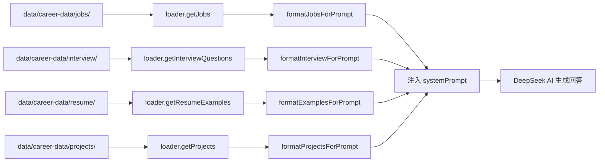
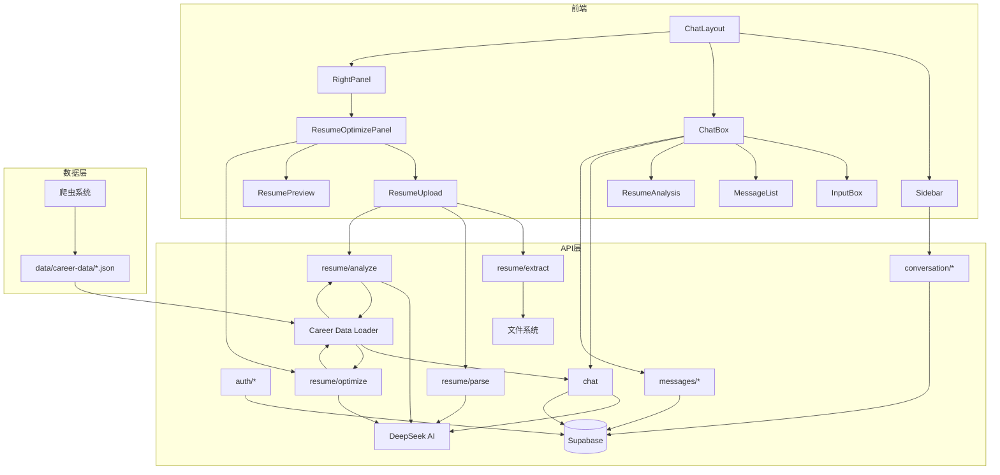

# AI Career Assistant — 完整项目文档

> 基于 Next.js 16 + Supabase + DeepSeek AI 的智能求职助手
> 支持简历优化、岗位匹配、模拟面试三大模式

---

## 一、项目架构总览

```
ai_Career_Assistant/
├── app/                          # Next.js App Router 页面 & API
│   ├── page.tsx                  # 根页面 → 重定向到 /chat
│   ├── layout.tsx                # 根布局
│   ├── middleware.ts             # Supabase 认证中间件
│   ├── globals.css               # 全局样式
│   ├── chat/page.tsx             # 聊天主页面
│   ├── test/page.tsx             # 简历解析测试页
│   └── api/                      # 所有后端 API
│       ├── auth/                 # 认证 (登录/注册/用户/登出)
│       ├── chat/                 # AI 聊天 (streamText)
│       ├── conversation/         # 对话管理 (创建/标题)
│       ├── conversations/        # 对话列表 (GET/DELETE)
│       ├── messages/             # 消息管理 (GET/POST)
│       ├── resume/               # 简历 (提取/解析/分析/优化/上传)
│       ├── career/               # 职业数据 (岗位/面试/项目/案例)
│       ├── profile/              # 用户画像 (生成/更新)
│       └── crawler/              # 爬虫触发
├── components/                   # React 组件
│   ├── ChatLayout.tsx            # 主布局 (三栏: 侧边栏+聊天+右面板)
│   ├── ChatBox.tsx               # 聊天核心 (useChat + 消息渲染)
│   ├── InputBox.tsx              # 输入框
│   ├── Message.tsx               # 单条消息
│   ├── MessageList.tsx           # 消息列表
│   ├── Sidebar.tsx               # 侧边栏 (对话历史)
│   ├── ModeSelector.tsx          # 模式切换 (简历/岗位/面试)
│   ├── AuthModal.tsx             # 登录/注册弹窗
│   ├── Resume/                   # 简历模块
│   │   ├── ResumeUpload.tsx      # 简历上传+解析+分析
│   │   ├── ResumeAnalysis.tsx    # 分析报告展示
│   │   └── ResumePreview.tsx     # 简历预览+PDF导出
│   └── RightPanel/               # 右面板
│       ├── index.tsx             # 面板路由
│       ├── ResumeOptimizePanel.tsx # 简历优化面板
│       ├── JobMatchPanel.tsx     # 岗位匹配面板(占位)
│       └── InterviewPanel.tsx    # 模拟面试面板(占位)
├── lib/                          # 工具库
│   ├── deepseek/ai.ts            # DeepSeek AI 客户端
│   ├── supabase/                 # Supabase 客户端 (client/server)
│   ├── prompts/resume.ts         # 所有 AI Prompt 模板
│   ├── career-data/loader.ts     # 职业数据加载器 (带缓存)
│   └── crawlers/                 # 爬虫系统
│       ├── index.ts              # CLI 入口
│       ├── scheduler.ts          # 定时任务
│       ├── config/               # 爬虫配置
│       ├── crawlers/             # 各爬虫实现
│       ├── types/                # 类型定义
│       └── utils/                # 工具函数
├── css/                          # CSS Modules
├── types/                        # TypeScript 类型
└── next.config.ts                # Next.js 配置
```

### 技术栈

| 层级 | 技术 |
|------|------|
| 框架 | Next.js 16.2.10 (App Router) |
| 前端 | React 19 + TypeScript 5 |
| AI | DeepSeek (deepseek-v4-flash) via @ai-sdk |
| 数据库 | Supabase (PostgreSQL + Auth) |
| 样式 | CSS Modules + Tailwind CSS 4 |
| 爬虫 | Puppeteer + Cheerio + Axios |
| 文件解析 | pdf-parse + mammoth |
| 消息流 | AI SDK useChat + streamText |

---

## 二、功能数据流程图

### 2.1 用户认证流程



### 2.2 对话管理流程



### 2.3 AI 聊天流程



### 2.4 简历优化完整流程 (核心)



### 2.5 爬虫数据采集流程



### 2.6 职业数据注入 AI 的数据流



---

## 三、数据库表结构

### conversations 表
| 列名 | 类型 | 说明 |
|------|------|------|
| id | uuid (PK) | 对话 ID |
| user_id | uuid (FK → auth.users) | 所属用户 |
| title | text | 对话标题 (AI 生成) |
| created_at | timestamp | 创建时间 |
| updated_at | timestamp | 更新时间 |

### messages 表
| 列名 | 类型 | 说明 |
|------|------|------|
| id | bigint (PK) | 消息 ID |
| conversation_id | uuid (FK → conversations) | 所属对话 |
| role | text | "user" 或 "assistant" |
| content | text | 消息内容 |
| created_at | timestamp | 创建时间 |

### resumes 表
| 列名 | 类型 | 说明 |
|------|------|------|
| id | bigint (PK) | 简历 ID |
| user_id | uuid (FK → auth.users) | 所属用户 |
| filename | text | 文件名 |
| content | text | 简历纯文本内容 |

### profiles 表
| 列名 | 类型 | 说明 |
|------|------|------|
| id | uuid (PK = user.id) | 用户 ID |
| profile | jsonb | AI 生成的结构化用户画像 |

---


## 四、API 路由逐行代码讲解

### 4.1 `/api/auth/login` — 用户登录

```typescript
// 导入 Supabase 服务端客户端工厂函数
import { createClient } from "@/lib/supabase/server";

// POST 方法：处理登录请求
export async function POST(req: Request) {
    // 从请求体解构 email 和 password
    const { email, password } = await req.json();

    // 创建 Supabase 服务端客户端实例（自动读取 Cookie）
    const supabase = await createClient();

    // 调用 Supabase 密码登录方法
    const { data, error } = await supabase.auth.signInWithPassword({
        email,    // 用户邮箱
        password  // 用户密码
    });

    // 如果有错误，返回 400 + 错误信息
    if (error) {
        return Response.json(
            { error: error.message },
            { status: 400 }
        );
    }

    // 登录成功，返回用户对象
    return Response.json({ user: data.user });
}
```

### 4.2 `/api/auth/register` — 用户注册

```typescript
import { createClient } from "@/lib/supabase/server";

export async function POST(req: Request) {
    const { email, password } = await req.json();
    const supabase = await createClient();

    // Supabase signUp：创建新用户，会发送确认邮件
    const { data, error } = await supabase.auth.signUp({
        email,
        password
    });

    if (error) {
        return Response.json({ error: error.message }, { status: 400 });
    }

    return Response.json({ user: data.user });
}
```

### 4.3 `/api/auth/user` — 获取当前用户

```typescript
import { createClient } from "@/lib/supabase/server";

export async function GET() {
    const supabase = await createClient();
    // getUser() 从 Cookie 中的 JWT 解析当前用户
    const { data: { user } } = await supabase.auth.getUser();
    return Response.json({ user }); // 未登录时 user 为 null
}
```

### 4.4 `/api/auth/layout` — 用户登出

```typescript
import { createClient } from "@/lib/supabase/server";

export async function POST(req: Request) {
    const supabase = await createClient();
    // signOut() 清除服务端 Session + Cookie
    const { error } = await supabase.auth.signOut();
    if (error) {
        return Response.json({ error: error.message }, { status: 500 });
    }
    return Response.json({ success: true });
}
```

### 4.5 `/api/chat` — AI 聊天 (核心路由)

```typescript
import { NextRequest } from 'next/server';
import { streamText, generateText } from 'ai';
import { createClient } from "@/lib/supabase/server";
import { resumeOptimizePrompt, buildResumeOptimizePrompt,
         buildJobMatchPrompt, buildInterviewPrompt } from "@/lib/prompts/resume";
import { deepseek } from "@/lib/deepseek/ai";
import { getJobs, getInterviewQuestions, getResumeExamples,
         formatJobsForPrompt, formatInterviewForPrompt,
         formatExamplesForPrompt } from "@/lib/career-data/loader";

export async function POST(request: NextRequest) {
    // ── 1. 鉴权 ──
    const supabase = await createClient();
    const { data: { user }, error } = await supabase.auth.getUser();
    if (!user) {
        return new Response("Unauthorized", { status: 401 });
    }

    try {
        // ── 2. 解构请求体 ──
        // messages: 当前对话所有消息 (由 useChat 发送)
        // conversationId: 当前对话 ID
        // mode: 当前模式 ("resume_optimize" | "job_match" | "interview")
        // resume: 当前上传的简历数据
        const { messages, conversationId, mode, resume } = await request.json();

        // ── 3. 转换消息格式 ──
        // useChat 发送的消息是 parts 格式，需要提取 text
        const modelMessages = messages.map((msg: any) => ({
            role: msg.role,
            content: msg.parts
                ?.filter((p: any) => p.type === "text")
                .map((p: any) => p.text)
                .join("") || ""
        }));

        const lastMessage = messages[messages.length - 1];
        const userSkills: string[] = resume?.skills || [];

        // ── 4. 根据模式构建 systemPrompt + 注入市场数据 ──
        let systemPrompt = "";
        try {
            switch (mode) {
                case "resume_optimize": {
                    // 根据用户技能筛选相关岗位 (最多5个)
                    const jobs = getJobs({ skills: userSkills, limit: 5 });
                    // 获取简历优秀案例 (最多2个)
                    const examples = getResumeExamples({ limit: 2 });
                    // 构建包含市场数据的 prompt
                    systemPrompt = buildResumeOptimizePrompt(
                        formatJobsForPrompt(jobs),
                        formatExamplesForPrompt(examples)
                    );
                    break;
                }
                case "job_match": {
                    const jobs = getJobs({ skills: userSkills, limit: 8 });
                    systemPrompt = buildJobMatchPrompt(formatJobsForPrompt(jobs));
                    break;
                }
                case "interview": {
                    // 根据用户技能确定面试分类
                    const categoryMap: Record<string, string> = {
                        react: "react", vue: "vue", typescript: "typescript",
                        javascript: "javascript", css: "css", node: "engineering"
                    };
                    const category = userSkills
                        .map((s: string) => categoryMap[s.toLowerCase()])
                        .filter(Boolean)[0] || "react";
                    const questions = getInterviewQuestions({ category, limit: 10 });
                    systemPrompt = buildInterviewPrompt(
                        formatInterviewForPrompt(questions)
                    );
                    break;
                }
                default:
                    systemPrompt = "";
            }
        } catch (dataErr) {
            // 数据注入失败不影响主流程，降级到基础 prompt
            switch (mode) {
                case "resume_optimize": systemPrompt = resumeOptimizePrompt; break;
                default: systemPrompt = "";
            }
        }

        // ── 5. 提取用户最后一条消息的文本 ──
        const userText = lastMessage.parts
            .filter((p: any) => p.type === 'text')
            .map((p: any) => p.text)
            .join("");

        // ── 6. 确保对话存在 ──
        const { data: conversation } = await supabase
            .from("conversations")
            .select("id,title")
            .eq("id", conversationId)
            .single();

        if (!conversation) {
            // 对话不存在则创建
            await supabase
                .from("conversations")
                .insert({
                    id: conversationId,
                    title: "New Chat",
                    user_id: user.id
                });
        }

        // ── 7. 保存用户消息到数据库 ──
        const { error: msgError } = await supabase
            .from("messages")
            .insert({
                conversation_id: conversationId,
                role: "user",
                content: userText
            });

        // ── 8. 调用 DeepSeek 流式生成 ──
        const result = streamText({
            model: deepseek('deepseek-v4-flash'),
            instructions: systemPrompt,  // 系统提示词
            messages: modelMessages,     // 完整对话历史

            // 流式生成完成后的回调
            onFinish: async ({ text }) => {
                // 保存 AI 回复到 messages 表
                const { error: saveErr } = await supabase
                    .from("messages")
                    .insert({
                        conversation_id: conversationId,
                        role: "assistant",
                        content: text
                    });

                if (!conversationId) return;

                // 查询当前对话标题
                const { data: conv } = await supabase
                    .from("conversations")
                    .select("title, user_id")
                    .eq("id", conversationId)
                    .single();

                // 如果标题还是默认的 "New Chat"，用 AI 生成新标题
                if (conv?.title === "New Chat" || conv?.title === "新对话") {
                    const titlePrompt = `请根据以下内容生成简短的聊天标题...\n${userText}`;

                    const titleResult = await generateText({
                        model: deepseek("deepseek-v4-flash"),
                        prompt: titlePrompt
                    });

                    // 更新标题 (带 user_id 检查确保安全)
                    await supabase
                        .from("conversations")
                        .update({ title: titleResult.text.trim() })
                        .eq("id", conversationId)
                        .eq("user_id", user.id);
                }
            }
        });

        // 返回流式响应 (UI 会实时显示 AI 生成内容)
        return result.toUIMessageStreamResponse();
    } catch (err) {
        return new Response("Stream error", { status: 500 });
    }
}
```

### 4.6 `/api/conversation` — 创建对话

```typescript
import { createClient } from "@/lib/supabase/server";

export async function POST(req: Request) {
    try {
        const supabase = await createClient();
        const { data: { user } } = await supabase.auth.getUser();

        if (!user) {
            return Response.json({ error: "未登录" }, { status: 401 });
        }

        // 插入新对话，标题默认为"新对话"
        const { data, error } = await supabase
            .from("conversations")
            .insert({
                title: "新对话",
                user_id: user.id
            })
            .select()     // 返回插入的数据
            .single();    // 只取一行

        if (error) {
            return Response.json({ error: error.message }, { status: 500 });
        }

        return Response.json({ data });
    } catch (error: any) {
        return Response.json({ error: error.message }, { status: 500 });
    }
}
```

### 4.7 `/api/conversations` — 对话列表 & 删除

```typescript
import { createClient } from "@/lib/supabase/server";

// GET: 获取当前用户所有对话
export async function GET() {
    const supabase = await createClient();
    const { data: { user } } = await supabase.auth.getUser();
    if (!user) {
        return Response.json({ error: "Unauthorized" }, { status: 401 });
    }

    const { data, error } = await supabase
        .from("conversations")
        .select("id,title,created_at")
        .eq("user_id", user.id)          // 只查当前用户的
        .order("created_at", { ascending: true });

    return Response.json({ conversations: data });
}

// DELETE: 删除指定对话 (含其所有消息)
export async function DELETE(req: Request) {
    const supabase = await createClient();
    const { data: { user } } = await supabase.auth.getUser();
    const { searchParams } = new URL(req.url);
    const id = searchParams.get("id");

    if (!user) return Response.json({ error: "Unauthorized" }, { status: 401 });
    if (!id) return Response.json({ error: "Missing id" }, { status: 400 });

    // 验证对话归属当前用户
    const { data: conversation } = await supabase
        .from("conversations")
        .select("id, user_id")
        .eq("id", id)
        .single();

    if (!conversation || conversation.user_id !== user.id) {
        return Response.json({ error: "No permission" }, { status: 403 });
    }

    // 先删除该对话的所有消息 (子表)
    await supabase.from("messages").delete().eq("conversation_id", id);

    // 再删除对话本身
    const { data: deletedRows, error } = await supabase
        .from("conversations")
        .delete()
        .eq("id", id)
        .select("id"); // 返回被删的行数

    return Response.json({ success: true, deleted: deletedRows?.length });
}
```

### 4.8 `/api/messages` — 消息管理

```typescript
import { createClient } from "@/lib/supabase/server";
import { NextRequest } from "next/server";

// GET: 获取指定对话的所有消息 (用于加载历史)
export async function GET(req: NextRequest) {
    const supabase = await createClient();
    const { data: { user } } = await supabase.auth.getUser();
    if (!user) return Response.json({ error: "Unauthorized" }, { status: 401 });

    const conversationId = req.nextUrl.searchParams.get('conversationId');

    // 验证对话归属 + 查询消息
    const { data: conversation } = await supabase
        .from("conversations")
        .select("id")
        .eq("id", conversationId)
        .eq("user_id", user.id)
        .single();

    if (!conversation) return Response.json({ error: "Not found" }, { status: 404 });

    const { data } = await supabase
        .from("messages")
        .select('id, role, content, created_at')
        .eq('conversation_id', conversationId)
        .order('created_at', { ascending: true });

    return Response.json({ messages: data });
}

// POST: 手动保存消息 (如简历分析摘要)
export async function POST(req: Request) {
    const supabase = await createClient();
    const { data: { user } } = await supabase.auth.getUser();
    if (!user) return Response.json({ error: "Unauthorized" }, { status: 401 });

    const { conversationId, role, content } = await req.json();

    const { data, error } = await supabase
        .from("messages")
        .insert({ conversation_id: conversationId, role, content })
        .select()
        .single();

    return Response.json({ data });
}
```

### 4.9 `/api/conversation/title` — AI 生成标题

```typescript
import { NextRequest } from "next/server";
import { generateText } from "ai";
import { deepseek } from "@/lib/deepseek/ai";
import { createClient } from "@/lib/supabase/server";

export async function POST(req: NextRequest) {
    const supabase = await createClient();
    const { data: { user } } = await supabase.auth.getUser();
    if (!user) return Response.json({ error: "Unauthorized" }, { status: 401 });

    const { conversationId, content } = await req.json();

    // 构建标题生成 prompt
    const prompt = `请根据以下内容生成一个不超过10字的中文标题...\n${content}`;

    // 调用 DeepSeek 生成标题
    const result = await generateText({
        model: deepseek("deepseek-v4-flash"),
        prompt
    });

    const title = result.text.trim();

    // 更新对话标题 (带 user_id 安全检查)
    const { data: updatedRows, error } = await supabase
        .from("conversations")
        .update({ title })
        .eq("id", conversationId)
        .eq("user_id", user.id)
        .select("id, title");

    return Response.json({ title });
}
```

### 4.10 `/api/resume/extract` — 文件文本提取

```typescript
import { NextRequest } from "next/server";
import { createClient } from "@/lib/supabase/server";

export async function POST(req: NextRequest) {
    const supabase = await createClient();
    const { data: { user } } = await supabase.auth.getUser();
    if (!user) return Response.json({ error: "未登录" }, { status: 401 });

    // 解析 FormData (包含上传的文件)
    const formData = await req.formData();
    const file = formData.get("file") as File | null;
    if (!file) return Response.json({ error: "未收到文件" }, { status: 400 });

    const filename = file.name.toLowerCase();
    // 将文件读为 Buffer
    const buffer = Buffer.from(await file.arrayBuffer());
    let text = "";

    if (filename.endsWith(".md") || filename.endsWith(".txt")) {
        // 纯文本：直接 UTF-8 解码
        text = buffer.toString("utf-8");
    } else if (filename.endsWith(".pdf")) {
        // PDF：动态导入 pdf-parse (避免 SSR bundling 问题)
        const pdfParse = (await import("pdf-parse")).default;
        const pdfData = await pdfParse(buffer);
        text = pdfData.text;
    } else if (filename.endsWith(".docx")) {
        // Word：动态导入 mammoth
        const mammoth = await import("mammoth");
        const result = await mammoth.extractRawText({ buffer });
        text = result.value;
    } else if (filename.endsWith(".doc")) {
        return Response.json({ error: "暂不支持 .doc 格式" }, { status: 400 });
    } else {
        return Response.json({ error: "不支持的文件格式" }, { status: 400 });
    }

    // 验证内容长度 (至少20字符)
    if (!text || text.trim().length < 20) {
        return Response.json({ error: "文件内容过短或为空" }, { status: 400 });
    }

    return Response.json({ text, filename: file.name, charCount: text.length });
}
```

### 4.11 `/api/resume/parse` — AI 结构化解析

```typescript
import { generateText } from "ai";
import { deepseek } from "@/lib/deepseek/ai";
import { resumeParsePrompt } from "@/lib/prompts/resume";

export async function POST(req: NextRequest) {
    const { content } = await req.json(); // 简历纯文本

    // 调用 DeepSeek，将简历文本转为结构化 JSON
    const result = await generateText({
        model: deepseek("deepseek-v4-flash"),
        instructions: resumeParsePrompt,  // "你是专业简历解析助手..."
        prompt: content                   // 简历原文
    });

    // 解析 AI 返回的 JSON
    const jsonData = JSON.parse(result.text);

    return Response.json({
        success: true,
        data: jsonData,  // { basic:{name,email,phone}, skills:[], projects:[], education:[] }
        content          // 原始文本
    });
}
```

### 4.12 `/api/resume/upload` — 简历存储

```typescript
import { createClient } from "@/lib/supabase/server";

export async function POST(req: Request) {
    const supabase = await createClient();
    const { content, filename } = await req.json();
    const { data: { user } } = await supabase.auth.getUser();
    if (!user) return Response.json({ error: "未登录" }, { status: 401 });

    // 将简历文本存入 resumes 表
    const { data, error } = await supabase
        .from("resumes")
        .insert({ user_id: user.id, filename, content })
        .select()
        .single();

    return Response.json({ resumeId: data.id });
}
```

### 4.13 `/api/resume/analyze` — 简历深度分析

```typescript
import { deepseek } from "@/lib/deepseek/ai";
import { generateText } from "ai";
import { buildAnalyzePrompt } from "@/lib/prompts/resume";
import { getJobs, getResumeExamples,
         formatJobsForPrompt, formatExamplesForPrompt } from "@/lib/career-data/loader";

export async function POST(req: NextRequest) {
    const body = await req.json();
    const resume = body.resume;
    const userSkills: string[] = body.skills || resume?.skills || [];

    // ── 注入市场数据 ──
    let jobsStr: string | undefined;
    let examplesStr: string | undefined;
    try {
        const jobs = getJobs({ skills: userSkills, limit: 5 });
        jobsStr = formatJobsForPrompt(jobs);
        const examples = getResumeExamples({ limit: 2 });
        examplesStr = formatExamplesForPrompt(examples);
    } catch (e) {
        // 市场数据获取失败不影响主流程
    }

    // 构建包含市场数据的分析 prompt
    const prompt = buildAnalyzePrompt(jobsStr, examplesStr);

    // 调用 AI，prompt 末尾拼接简历 JSON
    const result = await generateText({
        model: deepseek("deepseek-v4-flash"),
        prompt: prompt + JSON.stringify(resume),
    });

    // 解析 AI 返回的结构化报告 JSON
    let report;
    try {
        let text = result.text.trim();
        // 清理可能的 markdown 代码块包裹
        if (text.startsWith("```")) {
            text = text.replace(/^```json?\n?/, "").replace(/\n?```$/, "");
        }
        report = JSON.parse(text);
    } catch (parseErr) {
        // JSON 解析失败，降级为原始文本
        report = {
            score: { total: 0, content: 0, structure: 0, keywords: 0 },
            summary: result.text,
            sections: [], keyword_gaps: [],
            market_insights: "", next_steps: [],
            _raw: true,  // 标记为原始文本
        };
    }

    return Response.json({ data: report });
}
```

### 4.14 `/api/resume/optimize` — 分段深度优化

```typescript
import { deepseek } from "@/lib/deepseek/ai";
import { generateText } from "ai";
import { sectionOptimizePrompt } from "@/lib/prompts/resume";
import { getJobs, getResumeExamples,
         formatJobsForPrompt, formatExamplesForPrompt } from "@/lib/career-data/loader";

export async function POST(req: NextRequest) {
    // section: "project" | "skills" | "experience"
    // sectionName: 项目名/技能分类名
    // original: 原始描述文本
    // targetRole: 目标岗位 (如 "前端开发工程师")
    // skills: 用户技能列表
    const { section, sectionName, original, targetRole, skills } = await req.json();

    if (!original) return Response.json({ error: "缺少原始内容" }, { status: 400 });

    // 注入市场数据作为上下文
    let context = "";
    try {
        const jobs = getJobs({ skills: skills || [], limit: 3 });
        if (jobs.length > 0) context += "\n\n# 市场参考岗位\n" + formatJobsForPrompt(jobs);
        const examples = getResumeExamples({ limit: 1 });
        if (examples.length > 0) context += "\n\n# 优秀写法参考\n" + formatExamplesForPrompt(examples);
    } catch (e) { /* non-critical */ }

    // 构建用户提示
    const userPrompt = `
目标岗位：${targetRole || "前端开发工程师"}
优化部分：${section} - ${sectionName || ""}
原始内容：
${original}
`;

    // 调用 AI 进行单段深度优化
    const result = await generateText({
        model: deepseek("deepseek-v4-flash"),
        prompt: sectionOptimizePrompt + context + "\n\n" + userPrompt,
    });

    // 解析返回的 JSON (optimized + changes + interview_questions + tech_highlights)
    let data;
    try {
        let text = result.text.trim();
        if (text.startsWith("```")) {
            text = text.replace(/^```json?\n?/, "").replace(/\n?```$/, "");
        }
        data = JSON.parse(text);
    } catch (e) {
        data = { optimized: result.text, changes: [], interview_questions: [], tech_highlights: [] };
    }

    return Response.json({ data });
}
```

### 4.15 `/api/profile/generate` — AI 用户画像生成

```typescript
import { createClient } from "@/lib/supabase/server";
import { deepseek } from "@/lib/deepseek/ai";
import { profilePrompt } from "@/lib/prompts/resume";
import { generateText } from "ai";

export async function POST(req: Request) {
    const supabase = await createClient();
    const { data: { user } } = await supabase.auth.getUser();
    if (!user) return Response.json({ error: "Unauthorized" }, { status: 401 });

    const { resume } = await req.json();

    // AI 将简历解析为结构化用户画像
    const result = await generateText({
        model: deepseek("deepseek-v4-flash"),
        prompt: profilePrompt + JSON.stringify(resume)
    });

    // 清理 markdown 代码块
    const cleanText = result.text.replace(/```json/g, "").replace(/```/g, "").trim();
    let profile;
    try {
        profile = JSON.parse(cleanText);
    } catch (parseErr) {
        return Response.json({ error: "AI returned invalid JSON" }, { status: 500 });
    }

    // upsert 到 profiles 表 (id = user.id)
    const { error } = await supabase
        .from("profiles")
        .upsert({ id: user.id, profile: profile });

    return Response.json({ profile });
}
```

### 4.16 `/api/career/*` — 职业数据查询接口

这四个路由都是只读的数据查询接口，结构类似：

```typescript
// /api/career/jobs — 查询岗位数据
export async function GET(req: NextRequest) {
    const level = searchParams.get("level");     // "junior" | "middle" | "senior"
    const skills = searchParams.get("skills");   // "React,Vue" (逗号分隔)
    const limit = parseInt(searchParams.get("limit") || "20");
    const data = getJobs({ level, skills, limit }); // 从本地 JSON 加载
    return Response.json({ jobs: data, total: data.length });
}

// /api/career/interview — 查询面试题
export async function GET(req: NextRequest) {
    const category = searchParams.get("category"); // "react" | "vue" | "typescript" | ...
    const level = searchParams.get("level");
    const data = getInterviewQuestions({ category, level, limit });
    return Response.json({ questions: data });
}

// /api/career/examples — 查询简历案例
export async function GET(req: NextRequest) {
    const targetLevel = searchParams.get("level");
    const data = getResumeExamples({ targetLevel, limit });
    return Response.json({ examples: data });
}

// /api/career/projects — 查询开源项目
export async function GET(req: NextRequest) {
    const stack = searchParams.get("stack"); // "react,vue"
    const data = getProjects({ stack, limit });
    return Response.json({ projects: data });
}
```

### 4.17 `/api/crawler/run` — 爬虫触发

```typescript
import { execFile } from "child_process";
import { promisify } from "util";

const execFileAsync = promisify(execFile);

export async function POST(req: NextRequest) {
    const supabase = await createClient();
    const { data: { user } } = await supabase.auth.getUser();
    if (!user) return Response.json({ error: "Unauthorized" }, { status: 401 });

    const task = req.nextUrl.searchParams.get("task") || "all";
    const validTasks = ["jobs","skills","skills-model","interview","projects","articles","resume","all"];
    if (!validTasks.includes(task)) return Response.json({ error: "Unknown task" }, { status: 400 });

    // 在子进程中执行爬虫脚本
    const { stdout, stderr } = await execFileAsync(
        "npx",
        ["ts-node", "lib/crawlers/index.ts", "--task", task],
        { cwd: process.cwd(), timeout: 300000 }  // 5分钟超时
    );

    return Response.json({ success: true, task, stdout: stdout.slice(-2000) });
}
```

---


## 五、前端组件逐行讲解

### 5.1 `ChatLayout.tsx` — 主布局

**职责**：整个应用的主容器，管理三大区域（侧边栏 + 聊天区 + 右面板）和所有全局状态。

```typescript
"use client"  // 标记为客户端组件（使用 hooks）
import Sidebar from "./Sidebar";
import ChatBox from "./ChatBox";
import { useEffect, useState } from "react";
import AuthModal from "./AuthModal";
import { Mode } from "@/types/chat";
import { ResumeReport, OptimizedSection } from "@/types/resume";
import ResumePreview from "./Resume/ResumePreview";
import RightPanel from "./RightPanel";

export default function ChatLayout() {
    // ── 状态管理 ──
    const [conversationId, setConversationId] = useState<string>("");  // 当前对话ID
    const [refresh, setRefresh] = useState(0);  // 刷新侧边栏的计数器
    const [showAuth, setShowAuth] = useState(false);  // 登录弹窗
    const [user, setUser] = useState(null);  // 当前用户
    const [checked, setChecked] = useState(false);  // 是否已检查登录状态
    const [mode, setMode] = useState<Mode>("resume_optimize");  // 当前模式
    const [resume, setResume] = useState(null);  // 解析后的简历数据
    const [report, setReport] = useState<ResumeReport | null>(null);  // AI分析报告
    const [optimizedSections, setOptimizedSections] = useState<OptimizedSection>({});  // 已优化的段落
    const [showPreview, setShowPreview] = useState(false);  // 是否显示简历预览
    const [analyzing, setAnalyzing] = useState(false);  // 是否正在分析

    // ── 登出处理 ──
    async function handleLogout() {
        const res = await fetch("/api/auth/layout", { method: "POST" });
        if (res.ok) {
            setUser(null);          // 清空用户
            setConversationId("");  // 清空对话
            setResume(null);        // 清空简历
            setReport(null);        // 清空报告
            setOptimizedSections({});
            setMode("resume_optimize");
            setRefresh(pre => pre + 1);  // 刷新侧边栏
        }
    }

    // ── 初始化：检查登录状态 ──
    useEffect(() => {
        async function checkUser() {
            const res = await fetch("/api/auth/user");
            const data = await res.json();
            if (data.user) setUser(data.user);
            setChecked(true);
        }
        checkUser();
    }, []);

    // ── 切换对话时重置简历状态 ──
    useEffect(() => {
        setResume(null);
        setReport(null);
        setOptimizedSections({});
        setAnalyzing(false);
    }, [conversationId]);

    // ── 段落优化回调 ──
    const handleSectionOptimized = (key: string, optimized: string) => {
        setOptimizedSections(prev => ({
            ...prev,
            [key]: { optimized, accepted: true }  // 自动接受优化结果
        }));
    };

    // ── 渲染：三栏布局 ──
    return (
        <div className={styles.layout}>
            {/* 左侧：对话历史 */}
            <div className={styles.sidebar}>
                <Sidebar
                    isLogin={!!user}
                    refresh={refresh}
                    activeId={conversationId}
                    onSelectConversation={(id) => setConversationId(id)}
                    onDeleteConversation={async (id) => {
                        await fetch(`/api/conversations?id=${id}`, { method: "DELETE" });
                        setRefresh(pre => pre + 1);
                    }}
                />
            </div>

            {/* 中间：聊天区域 */}
            <div className={styles.chat}>
                <ChatBox
                    resume={resume}
                    report={report}
                    mode={mode}
                    setMode={setMode}
                    user={user}
                    outLogout={handleLogout}
                    conversationId={conversationId}
                    onTitleUpdate={handleRefresh}
                    onLogin={() => setShowAuth(true)}
                />
            </div>

            {/* 右侧：功能面板 */}
            <div className={styles.resume}>
                <RightPanel
                    mode={mode}
                    resume={resume}
                    report={report}
                    optimizedSections={optimizedSections}
                    analyzing={analyzing}
                    onReport={setReport}
                    onResumeChange={setResume}
                    onAnalyzingChange={setAnalyzing}
                    onSectionOptimized={handleSectionOptimized}
                    onShowPreview={() => setShowPreview(true)}
                    conversationId={conversationId}
                    onTitleUpdate={handleRefresh}
                />
            </div>

            {/* 弹窗层 */}
            {showAuth && <AuthModal onClose={() => setShowAuth(false)} />}
            {showPreview && resume && (
                <ResumePreview
                    resume={resume}
                    optimizedSections={optimizedSections}
                    onClose={() => setShowPreview(false)}
                />
            )}
        </div>
    );
}
```

### 5.2 `ChatBox.tsx` — 聊天核心

**职责**：管理 useChat hook、消息发送、历史加载、报告注入。

**关键机制**：
- **DefaultChatTransport**：拦截 useChat 的 fetch，在请求体中注入 `conversationId`、`mode`、`resume`
- **`__REPORT__` 标记**：当 AI 分析报告生成时，在消息列表中插入一条特殊消息，MessageList 会替换为 `<ResumeAnalysis>` 组件
- **历史加载**：切换对话时从 `/api/messages` 加载历史消息并设置到 useChat

```typescript
// 核心 transport 拦截
const transport = useMemo(() => {
    return new DefaultChatTransport({
        api: "/api/chat",
        fetch: async (url, options) => {
            let body = JSON.parse(options?.body as string);
            return fetch(url, {
                ...options,
                body: JSON.stringify({
                    ...body,
                    conversationId: conversationIdRef.current,
                    mode: modeRef.current,
                    resume: resumeRef.current
                })
            });
        }
    });
}, []);

// useChat hook
const { messages, sendMessage, status, setMessages } = useChat({
    id: conversationId,
    transport,
    async onFinish(message) {
        await new Promise(resolve => setTimeout(resolve, 3000));
        onTitleUpdate();  // 触发侧边栏刷新
    }
});
```

### 5.3 `InputBox.tsx` — 消息输入

简单的受控输入框 + 回车发送。

### 5.4 `Message.tsx` — 单条消息

根据 `role` 区分用户消息和 AI 消息的样式（头像、气泡颜色、对齐方式）。

### 5.5 `MessageList.tsx` — 消息列表

**特殊逻辑**：
- 如果消息的 `isReport` 为 true 且 `reportComponent` 存在，渲染 `<ResumeAnalysis>` 替代文本
- 显示 "Thinking..." 加载指示器

### 5.6 `Sidebar.tsx` — 对话历史侧边栏

**职责**：显示用户的对话列表，支持新建和删除对话。

- 通过 `fetch("/api/conversations")` 获取对话列表
- 点击 "+ New Chat" 调用 `POST /api/conversation` 创建新对话
- 点击对话项触发 `onSelectConversation`
- 点击删除图标调用 `onDeleteConversation`

### 5.7 `ModeSelector.tsx` — 模式切换

三个按钮：📝 简历优化 | 🎯 岗位匹配 | 🎤 模拟面试
当前模式加粗显示。

### 5.8 `AuthModal.tsx` — 登录/注册弹窗

支持登录和注册两种模式的切换。
- 登录：`POST /api/auth/login` → 刷新页面
- 注册：`POST /api/auth/register`
- 切换模式时清空输入框

### 5.9 `ResumeUpload.tsx` — 简历上传 + 全流程编排

**这是简历流程的入口**，编排了 6 个步骤：

1. **文件提取**：`POST /api/resume/extract` (FormData)
2. **存储**：`POST /api/resume/upload`
3. **AI 解析**：`POST /api/resume/parse` → `onParsed(resume)`
4. **用户画像**：`POST /api/profile/generate` (非关键)
5. **深度分析**：`POST /api/resume/analyze` → `onAnalysis(report)`
6. **标题生成**：`POST /api/conversation/title` (非关键)

### 5.10 `ResumeAnalysis.tsx` — 分析报告组件

**展示内容**：
- **ScoreCircle**：总分圆形图（绿/黄/红三色）
- **ScoreBar**：内容质量 / 结构规范 / 关键词覆盖 三项条形图
- **Sections**：可展开的 `<details>` 卡片，每个包含原文 vs 优化后对比
- **Keyword Gaps**：缺失的关键词标签
- **Market Insights**：市场洞察文本
- **Next Steps**：有序列表形式的下一步建议

### 5.11 `ResumePreview.tsx` — 简历预览 + PDF 导出

**牛客风格单栏模板**：
- 浅蓝标题栏 (`#e8f0fe`)
- 居中姓名 + 联系方式
- 教育经历 / 专业技能 / 项目经历三大块
- 技能按 9 个类别自动分组
- 项目描述自动拆分为 bullet points
- 优先使用 `optimizedSections` 中已接受的优化内容
- 导出 PDF：`window.print()` + `@media print` CSS

### 5.12 `RightPanel/index.tsx` — 面板路由

根据 `mode` 渲染不同面板：
- `resume_optimize` → `<ResumeOptimizePanel>`
- `job_match` → `<JobMatchPanel>` (占位)
- `interview` → `<InterviewPanel>` (占位)

### 5.13 `ResumeOptimizePanel.tsx` — 简历优化面板

**展示**：
- 未上传简历时：显示上传区域
- 已上传：显示文件状态 + 综合评分 + 各段落卡片
- 每个段落卡片有"深度优化"按钮，调用 `POST /api/resume/optimize`
- 优化完成后显示面试追问预测
- 底部"预览优化后简历"按钮触发 `onShowPreview()`

---

## 六、工具库 & 爬虫模块讲解

### 6.1 `lib/deepseek/ai.ts` — DeepSeek AI 客户端

```typescript
import { createDeepSeek } from "@ai-sdk/deepseek";

export const deepseek = createDeepSeek({
    baseURL: "https://api.deepseek.com/v1",
    apiKey: process.env.DEEPSEEK_API_KEY,
    fetch: (url, options) => {
        // 自定义 HTTPS agent：处理 SSL 证书问题 (代理/VPN 环境)
        const agent = new https.Agent({
            rejectUnauthorized: false,
            secureProtocol: "TLSv1_2_method",
            ciphers: "ECDHE-RSA-AES128-GCM-SHA256:...",
            minVersion: "TLSv1.2",
            maxVersion: "TLSv1.3"
        });
        return fetch(url, { ...options, agent } as any);
    }
});
```

### 6.2 `lib/supabase/server.ts` — 服务端客户端

```typescript
import { createServerClient } from "@supabase/ssr";
import { cookies } from "next/headers";

export async function createClient() {
    const cookieStore = await cookies();
    return createServerClient(
        process.env.NEXT_PUBLIC_SUPABASE_URL!,
        process.env.NEXT_PUBLIC_SUPABASE_ANON_KEY!,
        {
            cookies: {
                getAll() { return cookieStore.getAll(); },
                setAll(cookiesToSet) {
                    cookiesToSet.forEach(({ name, value, options }) => {
                        cookieStore.set(name, value, options);
                    });
                }
            }
        }
    );
}
```

### 6.3 `lib/supabase/client.ts` — 浏览器端客户端

```typescript
import { createClient } from "@supabase/supabase-js";
export const supabase = createClient(
    process.env.NEXT_PUBLIC_SUPABASE_URL!,
    process.env.NEXT_PUBLIC_SUPABASE_ANON_KEY!
);
```

### 6.4 `lib/career-data/loader.ts` — 职业数据加载器

**核心特性**：
- **文件缓存 + TTL**：60秒 TTL，基于文件 mtime 判断是否过期
- **数据源**：`data/career-data/` 目录下的 JSON 文件
- **查询函数**：`getJobs`、`getInterviewQuestions`、`getProjects`、`getResumeExamples`
- **格式化函数**：`formatJobsForPrompt`、`formatInterviewForPrompt`、`formatExamplesForPrompt`
  - 限制最大字符数避免 prompt 过长
  - 返回紧凑的单行格式

### 6.5 `lib/prompts/resume.ts` — Prompt 模板库

包含所有 AI 操作的 prompt：

| Prompt | 用途 |
|--------|------|
| `resumeParsePrompt` | 简历文本 → 结构化 JSON |
| `profilePrompt` | 简历 → 用户画像 JSON |
| `resumeAnalyzePrompt` | 简历深度分析 → 评分 + 分段优化 + 关键词差距 |
| `resumeOptimizePrompt` | 聊天模式下的简历优化 |
| `sectionOptimizePrompt` | 单段深度优化 (返回面试追问) |
| `jobMatchPrompt` | 岗位匹配分析 |
| `interviewPrompt` | 模拟面试 (一问一答模式) |
| `buildAnalyzePrompt()` | 注入市场数据的分析 prompt |
| `buildResumeOptimizePrompt()` | 注入市场数据的优化 prompt |
| `buildJobMatchPrompt()` | 注入岗位数据的匹配 prompt |
| `buildInterviewPrompt()` | 注入题库数据的面试 prompt |

### 6.6 爬虫系统

#### 架构
```
lib/crawlers/
├── index.ts           # CLI 入口 (--task 参数)
├── scheduler.ts       # 定时任务 (node-cron)
├── config/
│   └── crawler.config.ts  # 全局配置 (URL、关键词、数量目标)
├── crawlers/
│   ├── jobs.ts        # 岗位 JD 生成 (模板化)
│   ├── interview.ts   # 面试题采集 (GitHub awesome lists)
│   ├── projects.ts    # GitHub 项目采集
│   ├── articles.ts    # 技术文章采集
│   ├── resume_examples.ts  # 简历案例采集
│   ├── skills.ts      # 技能文档采集 (MDN/React/Vue/TS 官方文档)
│   └── skills_model.ts # 技能关系模型
├── types/index.ts     # 所有数据类型定义
└── utils/
    ├── http.ts        # 带重试的 HTTP 请求
    ├── storage.ts     # JSON/Markdown 文件读写
    ├── formatter.ts   # 文本清洗、哈希、去重
    └── logger.ts      # 日志 (控制台 + 文件)
```

#### 爬虫类型

| 爬虫 | 数据源 | 输出 |
|------|--------|------|
| `crawlJobs` | 模板生成 (8种岗位 × 3个等级) | `frontend_jobs.json` |
| `crawlInterview` | GitHub awesome-interview-questions | `questions.json` |
| `crawlProjects` | GitHub Search API | `projects.json` |
| `crawlArticles` | 官方博客 + 掘金 + SegmentFault | `frontend_articles.json` |
| `crawlResumeExamples` | AI 生成 | `resume_examples.json` |
| `crawlSkills` | MDN / React Dev / Vue Docs | Markdown 文档 |
| `crawlSkillsModel` | 基于岗位数据推断 | `skills_model.json` |

#### 去重机制
- 每条记录计算 MD5 哈希 (`hashContent`)
- 插入前检查已有数据中的哈希集合
- 合并时按哈希去重，保留 `collected_at` 最新的

#### 定时执行
`scheduler.ts` 使用 `node-cron` 库，默认每天凌晨 2 点执行全部采集任务。
通过 `npm run schedule` 启动。

---

## 七、类型定义

### `types/chat.ts`
```typescript
export type Mode = "resume_optimize" | "job_match" | "interview";
```

### `types/resume.ts`
```typescript
export interface ScoreBreakdown {
    total: number;      // 总分 (0-100)
    content: number;    // 内容质量分
    structure: number;  // 结构规范分
    keywords: number;   // 关键词覆盖分
}

export interface ReportSection {
    type: "project" | "skills" | "experience" | "education";
    name?: string;          // 项目名/公司名
    original: string;       // 原始描述
    optimized: string;      // 优化后描述
    changes: string[];      // 修改点列表
    suggested_add?: string[]; // 建议新增的技能
    score: number;          // 该段评分
}

export interface ResumeReport {
    score: ScoreBreakdown;
    summary: string;          // 总体评价
    sections: ReportSection[]; // 分段优化
    keyword_gaps: string[];   // 缺失关键词
    market_insights: string;  // 市场洞察
    next_steps: string[];     // 下一步建议
    _raw?: boolean;           // true 表示 JSON 解析失败的降级文本
}

export interface OptimizedSection {
    [key: string]: {         // key = "project_0" / "skills_1"
        optimized: string;   // 优化后的文本
        accepted: boolean;   // 是否已接受
    };
}

export interface SectionOptResult {
    optimized: string;
    changes: { what: string; why: string }[];
    interview_questions: string[];  // 面试追问预测
    tech_highlights: string[];      // 技术亮点
}
```

### `types/profile.ts`
```typescript
export interface Profile {
    level: string;       // 职级
    skills: string[];    // 技能列表
    advantages: string[]; // 优势
    weakness: string[];   // 不足
    targetJobs: string[]; // 目标岗位
}
```

---

## 八、环境配置

### `next.config.ts`
```typescript
const nextConfig: NextConfig = {
    // 不打包的外部包 (这些包使用 C++ addon 或动态 import)
    serverExternalPackages: ["puppeteer", "cheerio", "pdf-parse", "mammoth"],
};
```

### 环境变量 (`.env.local`)
```
NEXT_PUBLIC_SUPABASE_URL=https://xxx.supabase.co
NEXT_PUBLIC_SUPABASE_ANON_KEY=eyJhbGci...
DEEPSEEK_API_KEY=sk-xxx
GITHUB_TOKEN=ghp_xxx     # 可选，提升 GitHub API 限额
CRON_SCHEDULE=0 2 * * *  # 可选，爬虫定时任务
```

### NPM Scripts
```json
{
    "dev": "next dev",
    "build": "next build",
    "start": "next start",
    "crawl:jobs": "ts-node lib/crawlers/index.ts --task jobs",
    "crawl:skills": "ts-node lib/crawlers/index.ts --task skills",
    "crawl:interview": "ts-node lib/crawlers/index.ts --task interview",
    "crawl:projects": "ts-node lib/crawlers/index.ts --task projects",
    "crawl:articles": "ts-node lib/crawlers/index.ts --task articles",
    "crawl:resume": "ts-node lib/crawlers/index.ts --task resume",
    "crawl:all": "ts-node lib/crawlers/index.ts --task all",
    "schedule": "ts-node lib/crawlers/scheduler.ts"
}
```

---

## 九、完整数据流汇总图



---

> 文档生成时间：2026-07-25
> 项目版本：v1.0
